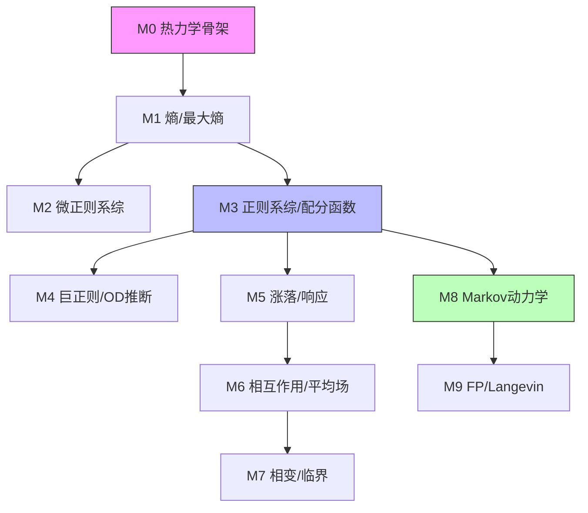

# Modules（学习路线）

按主线顺序：

- [M0 热力学骨架](M0_thermodynamics.md)
- [M1 概率·计数·熵·最大熵](M1_probability_entropy_maxent.md)
- [M2 微正则系综（孤立系统）](M2_microcanonical.md)
- [M3 正则系综与配分函数 Z](M3_canonical_partition_function.md)
- [M4 巨正则系综与可变规模（OD/人口）](M4_grand_canonical_variable_N.md)
- [M5 涨落—响应—相关](M5_fluctuation_response_correlation.md)
- [M6 相互作用与平均场](M6_interactions_mean_field.md)
- [M7 相变与标度](M7_phase_transition_scaling.md)
- [M8 随机过程与主方程](M8_markov_master_equation.md)
- [M9 Fokker–Planck 与 Langevin](M9_fokker_planck_langevin.md)

## 学习路径图谱

