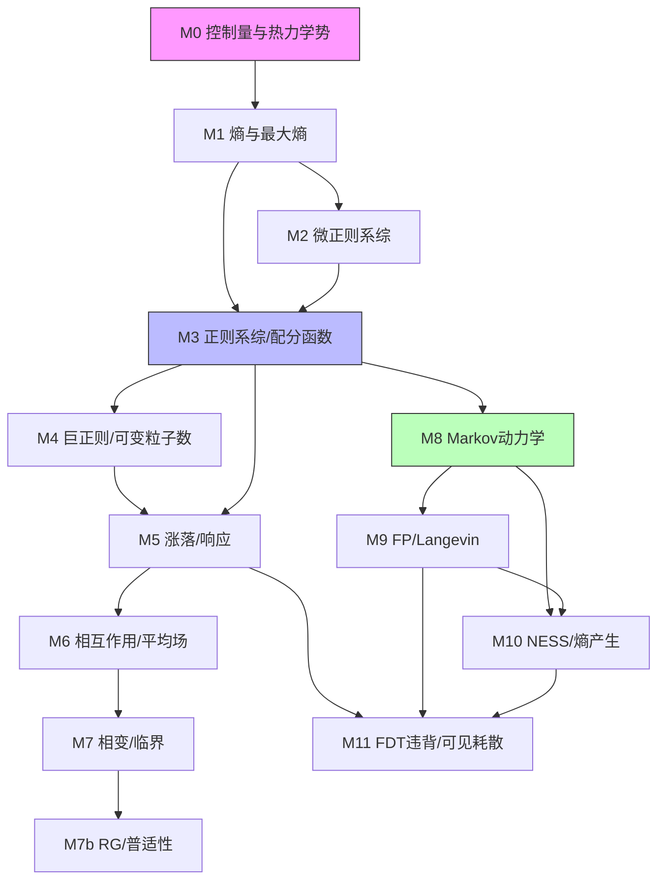

# Modules（学习路线）

## 课程海报（交互）

<InteractiveConcept type="course-poster" />

## 这门课程要解决什么问题？

统计物理面对的是同一个困难：微观自由度极多、轨迹充满随机性，宏观世界却常常稳定、可预测，而且会在持续驱动下表现出明确的时间方向。课程不按工具清单组织，而围绕三个递进问题展开。

### 1）可计算性：指数增长的微观态怎样变得可算？

直接枚举微观态通常不可行。统计物理通过改变描述层次，把问题变成可计数、可微分、可采样或可近似的对象：

- 微正则系综（M2）把硬约束转化为能量壳上的计数与典型性
- 正则与巨正则系综（M3–M4）把热力学响应编码进 $\ln Z$ 的导数
- 平均场（M6）：把强耦合多体问题近似成可算的单体问题
- RG（M7b）：识别哪些短尺度自由度可以被消去而不改变宏观奇异性
- 主方程与 Fokker–Planck 方程（M8–M9）：直接描述概率分布怎样演化

### 2）涌现与普适性：宏观规律为什么稳定，而且常常不依赖微观细节？

可计算并不自动意味着可理解。第二条路径追问宏观确定性、集体有序和普适标度从哪里来：

- 典型性（M2）：宏观确定性来自测度集中，而不是遍历每个微观态
- 涨落—响应（M5）：平衡动力学用自发涨落约束线性响应，指数族用协方差给出静态敏感度
- 相变、相关长度与普适类（M6–M7 / M7b）：临界行为由尺度结构与固定点决定

### 3）不可逆与非平衡：稳态分布不变，为什么过程仍有时间方向？

平衡分布只描述状态权重，不能独自说明系统怎样到达稳态，也不能判断稳态内部是否存在持续概率流：

- 主方程（M8）：区分“稳态分布”与“细致平衡/净流”
- Fokker–Planck（M9）：连续状态下的概率守恒、概率流与稳态条件
- NESS 与熵产生（M10）：从路径方向性定义 Markov 不可逆性，并说明何时才具有物理熵产生含义
- FDT 违背与 Harada–Sasa（M11）：从独立测得的涨落与响应估计探针可见耗散

## 核心模块（M0–M11）

编号表示概念依赖的大致顺序，不意味着所有模块必须沿一条直线阅读。M0–M5 建立共同基础，随后可以进入相变路径（M6–M7b）或随机动力学路径（M8–M10）；M11 汇合 M5、M9 与 M10 的语言。

- [M0 热力学势：控制什么，就最小化什么](M0_thermodynamics.md)
- [M1 熵与最大熵：有限信息允许怎样的分布](M1_probability_entropy_maxent.md)
- [M2 微正则系综：硬约束怎样产生宏观确定性](M2_microcanonical.md)
- [M3 正则系综：热库怎样把计数变成配分函数](M3_canonical_partition_function.md)
- [M4 巨正则系综：粒子数也能涨落时怎样记账](M4_grand_canonical_variable_N.md)
- [M5 涨落怎样预测响应：动态 FDT 与静态协方差](M5_fluctuation_response_correlation.md)
- [M6 相互作用与平均场：集体反馈怎样产生分叉](M6_interactions_mean_field.md)
- [M7 相变与标度：怎样从有限系统识别临界点](M7_phase_transition_scaling.md)
- [M8 主方程：分布不动，概率还会流动吗](M8_markov_master_equation.md)
- [M9 连续随机动力学：轨迹与概率怎样描述同一过程](M9_fokker_planck_langevin.md)
- [M10 非平衡稳态与熵产生：稳态环流怎样量化不可逆性](M10_nonequilibrium_steady_state_entropy_production.md)
- [M11 FDT 违背：怎样从谱差读出可见耗散](M11_fdt_violation_harada_sasa.md)

## 进阶模块

- [M7b 重整化群（RG）入门：为什么普适性存在](M7b_renormalization_group.md)

## 学习路径图谱

```mermaid
graph TD
    M0[M0 控制量与热力学势] --> M1[M1 熵与最大熵]
    M1 --> M2[M2 微正则系综]
    M1 --> M3[M3 正则系综/配分函数]
    M2 --> M3
    M3 --> M4[M4 巨正则/可变粒子数]
    M4 --> M5
    M3 --> M5[M5 涨落/响应]
    M5 --> M6[M6 相互作用/平均场]
    M6 --> M7[M7 相变/临界]
    M7 --> M7b[M7b RG/普适性]
    M3 --> M8[M8 Markov动力学]
    M8 --> M9[M9 FP/Langevin]
    M8 --> M10[M10 NESS/熵产生]
    M9 --> M10
    M5 --> M11[M11 FDT违背/可见耗散]
    M9 --> M11
    M10 --> M11
    
    style M0 fill:#f9f,stroke:#333
    style M3 fill:#bbf,stroke:#333
    style M8 fill:#bfb,stroke:#333
```
