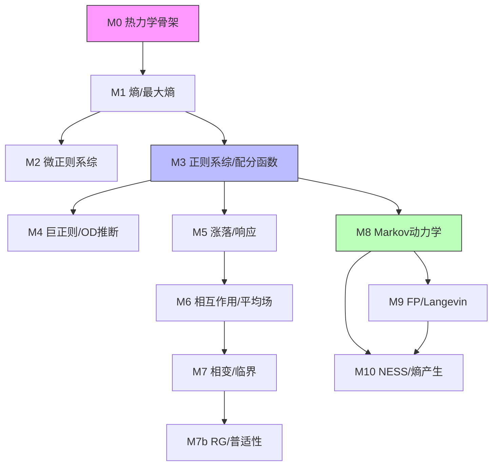

# Modules（学习路线）

## 主线（M0–M9）

- [M0 热力学骨架](M0_thermodynamics.md)
- [M1 概率·计数·熵·最大熵](M1_probability_entropy_maxent.md)
- [M2 微正则系综（孤立系统）](M2_microcanonical.md)
- [M3 正则系综与配分函数 Z](M3_canonical_partition_function.md)
- [M4 巨正则系综与可变规模（OD/人口）](M4_grand_canonical_variable_N.md)
- [M5 涨落—响应—相关](M5_fluctuation_response_correlation.md)
- [M6 相互作用与平均场](M6_interactions_mean_field.md)
- [M7 相变与标度](M7_phase_transition_scaling.md)
- [M8 随机过程与主方程](M8_markov_master_equation.md)
- [M9 Fokker–Planck 与 Langevin](M9_fokker_planck_langevin.md)

## 三条暗线（贯穿主线的三个问题）

> 统计物理的“进阶理解”并不来自背更多公式，而来自反复回答三个问题：信息不完备时如何推断？尺度变化时哪些东西会变/不会变？远离平衡时系统如何维持稳态？

- **信息与推断**：在缺信息时如何做最诚实的推断？（M1→M4）
- **标度与普适性**：为什么不同系统在临界点附近有相同行为？（M7→M7b）
- **非平衡与驱动**：分布不变并不等于“无净流”；驱动与耗散如何量化？（M8→M10）

## Advanced（可选/进阶）

- [M7b 重整化群（RG）入门：为什么普适性存在](M7b_renormalization_group.md)
- [M10 非平衡稳态与熵产生（NESS & EPR）](M10_nonequilibrium_steady_state_entropy_production.md)

## 学习路径图谱

```mermaid
graph TD
    M0[M0 热力学骨架] --> M1[M1 熵/最大熵]
    M1 --> M2[M2 微正则系综]
    M1 --> M3[M3 正则系综/配分函数]
    M3 --> M4[M4 巨正则/OD推断]
    M3 --> M5[M5 涨落/响应]
    M5 --> M6[M6 相互作用/平均场]
    M6 --> M7[M7 相变/临界]
    M7 --> M7b[M7b RG/普适性]
    M3 --> M8[M8 Markov动力学]
    M8 --> M9[M9 FP/Langevin]
    M8 --> M10[M10 NESS/熵产生]
    M9 --> M10
    
    style M0 fill:#f9f,stroke:#333
    style M3 fill:#bbf,stroke:#333
    style M8 fill:#bfb,stroke:#333
```
