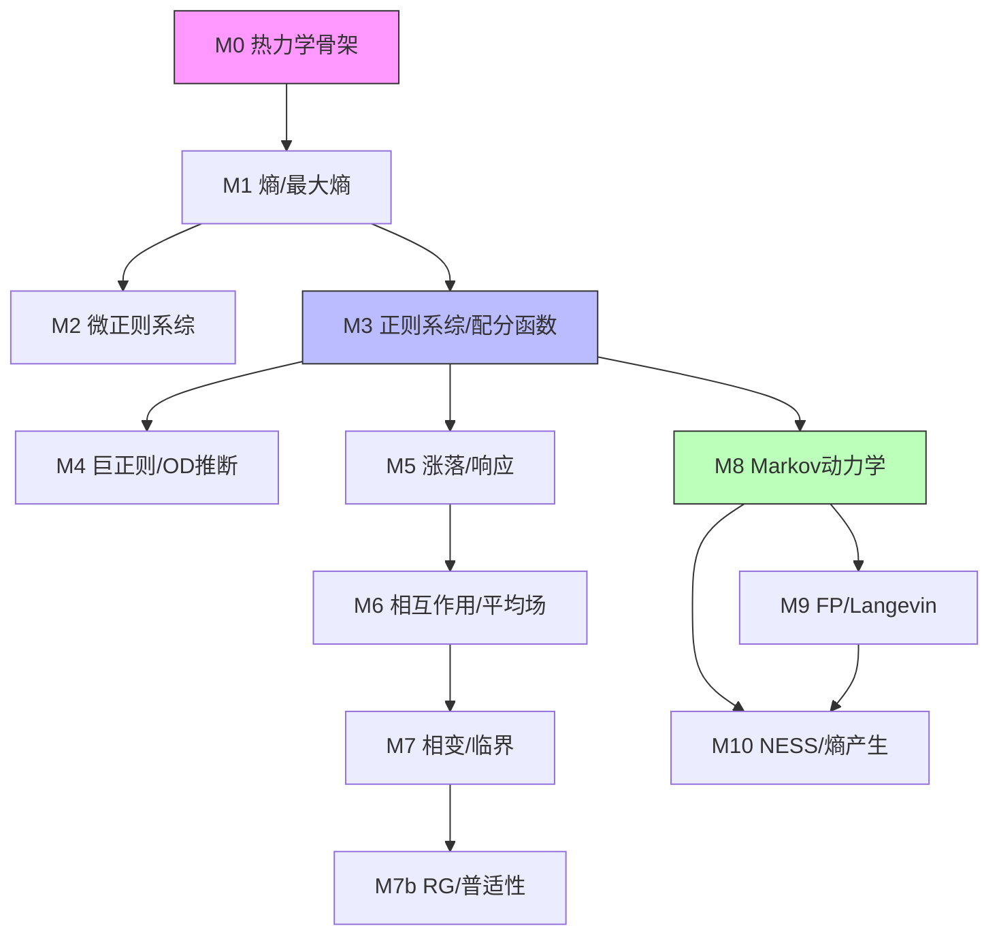

# Modules（学习路线）

## 课程海报（交互）

<InteractiveConcept type="course-poster" />

## 三层前言：你在这个仓库里到底要解决什么问题？

如果你第一次打开这个项目，最容易迷路的点是：每一章都在讲一个“工具”（$Z$、平均场、RG、主方程、Fokker–Planck……），但你不知道它们为什么属于同一条主线。  
这条主线其实是统计物理的三个层次问题：

### 1）可计算性（Tractability）：$e^N$ 的微观态，如何变得“可算”？
微观态数目指数爆炸，直接枚举不可能。我们用一系列“降维/重表述”的技巧把问题变成可微、可采样、可近似的对象：
- 系综（M2–M4）：把“计数 $\Omega$”变成“$\ln Z$ 的导数”
- 平均场（M6）：把强耦合多体问题近似成可算的单体问题
- RG / 标度（M7b）：识别哪些自由度可以被“边缘化/积分掉”而不改变宏观结论
- 主方程 / FP（M8–M9）：用演化方程替代穷举状态空间

### 2）涌现与普适性（Emergence & Universality）：为什么算出来的宏观规律“稳健”且常常不依赖细节？
这不是“算不算得动”，而是“凭什么宏观能稳定、且不同系统会共享指数/标度律”：
- 典型性（M2）：宏观确定性来自测度集中，而不是遍历每个微观态
- 涨落—响应（M5）：系统对外界的敏感度由自发涨落决定
- 相变、相关长度与普适类（M6–M7 / M7b）：临界行为由尺度结构与固定点决定

### 3）不可逆与非平衡（Irreversibility & Non-equilibrium）：平衡语言的边界在哪里？“稳态”不等于“平衡”
平衡态告诉你“终点长什么样”，但很多系统被持续驱动：分布可能不变，流却不停：
- 主方程（M8）：区分“稳态分布”与“细致平衡/净流”
- Fokker–Planck（M9）：连续状态下的概率守恒、概率流与稳态条件
- NESS 与熵产生（M10）：给“离平衡有多远”一个可计算的刻度

## 主线（M0–M9）

- [M0 热力学骨架](M0_thermodynamics.md)
- [M1 概率·计数·熵·最大熵](M1_probability_entropy_maxent.md)
- [M2 微正则系综（孤立系统）](M2_microcanonical.md)
- [M3 正则系综与配分函数 Z](M3_canonical_partition_function.md)
- [M4 巨正则系综与可变规模（OD/人口）](M4_grand_canonical_variable_N.md)
- [M5 涨落—响应—相关](M5_fluctuation_response_correlation.md)
- [M6 相互作用与平均场](M6_interactions_mean_field.md)
- [M7 相变与标度](M7_phase_transition_scaling.md)
- [M8 随机过程与主方程](M8_markov_master_equation.md)
- [M9 Fokker–Planck 与 Langevin](M9_fokker_planck_langevin.md)

## Advanced（可选/进阶）

- [M7b 重整化群（RG）入门：为什么普适性存在](M7b_renormalization_group.md)
- [M10 非平衡稳态与熵产生（NESS & EPR）](M10_nonequilibrium_steady_state_entropy_production.md)

## 学习路径图谱

```mermaid
graph TD
    M0[M0 热力学骨架] --> M1[M1 熵/最大熵]
    M1 --> M2[M2 微正则系综]
    M1 --> M3[M3 正则系综/配分函数]
    M3 --> M4[M4 巨正则/OD推断]
    M3 --> M5[M5 涨落/响应]
    M5 --> M6[M6 相互作用/平均场]
    M6 --> M7[M7 相变/临界]
    M7 --> M7b[M7b RG/普适性]
    M3 --> M8[M8 Markov动力学]
    M8 --> M9[M9 FP/Langevin]
    M8 --> M10[M10 NESS/熵产生]
    M9 --> M10
    
    style M0 fill:#f9f,stroke:#333
    style M3 fill:#bbf,stroke:#333
    style M8 fill:#bfb,stroke:#333
```
